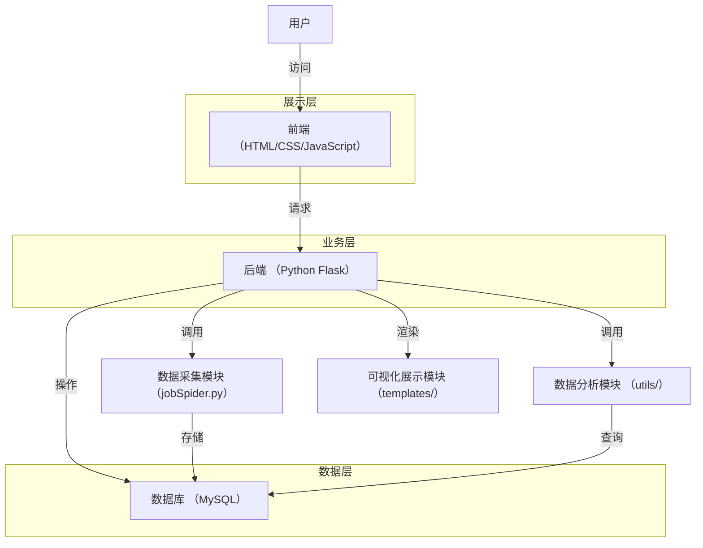
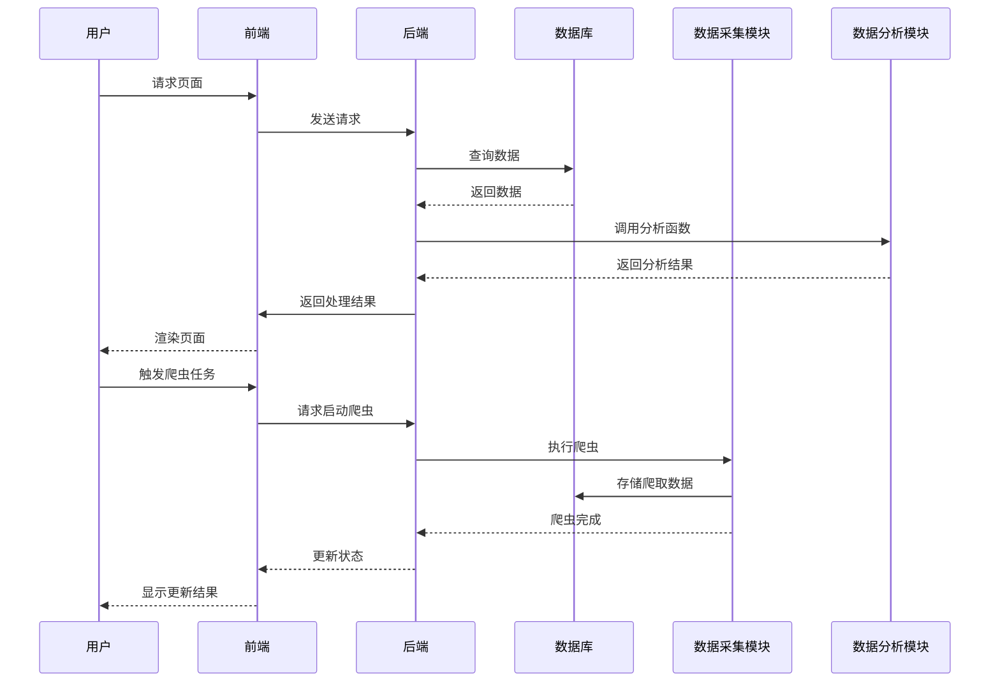
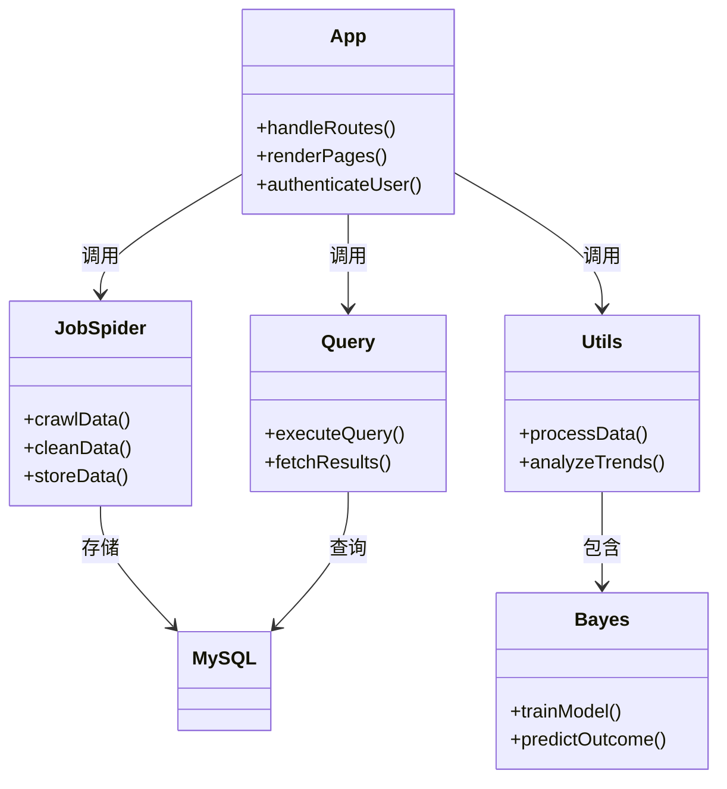
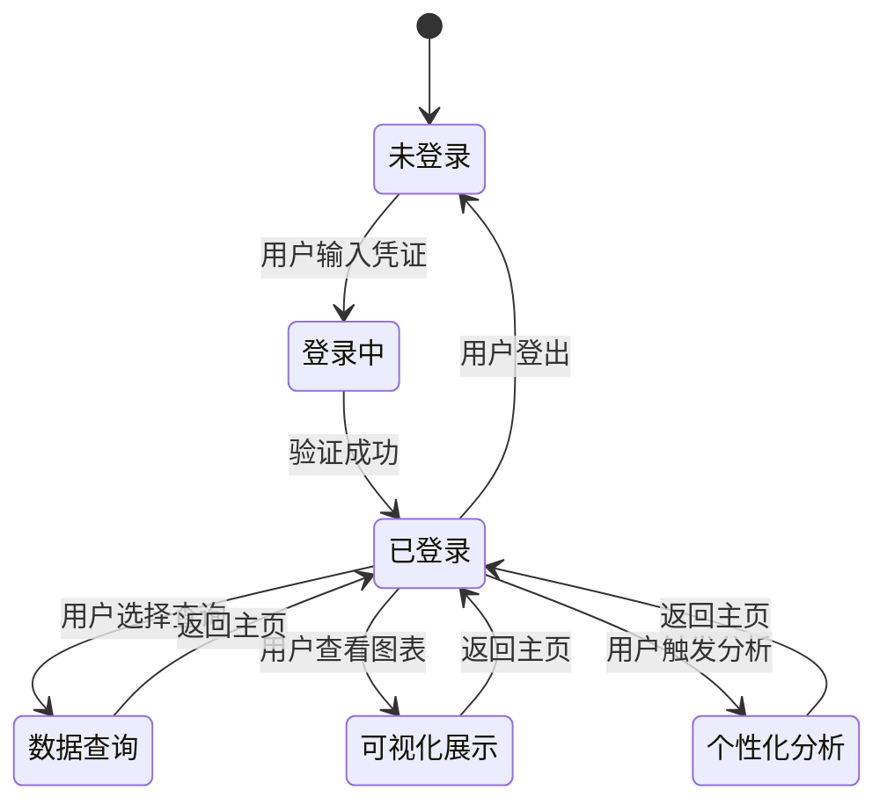
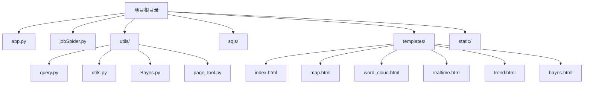
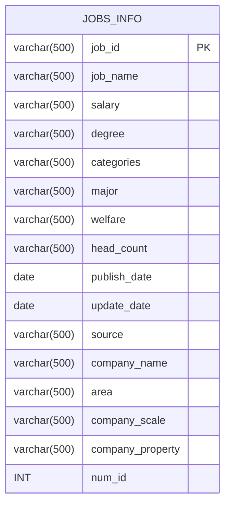
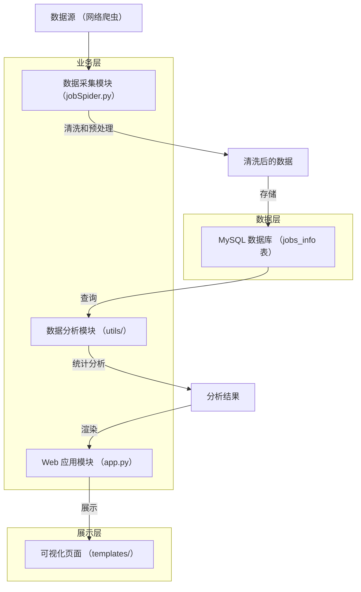
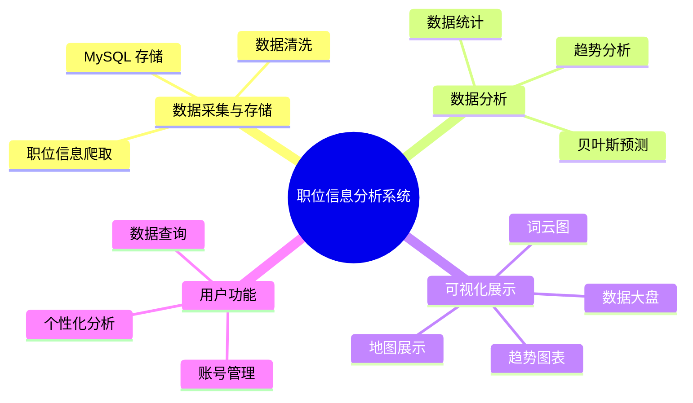
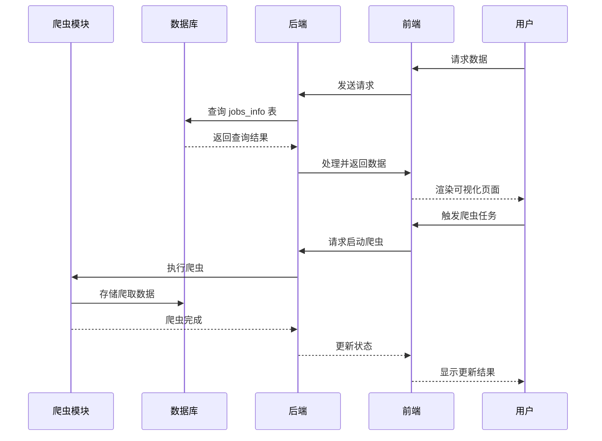
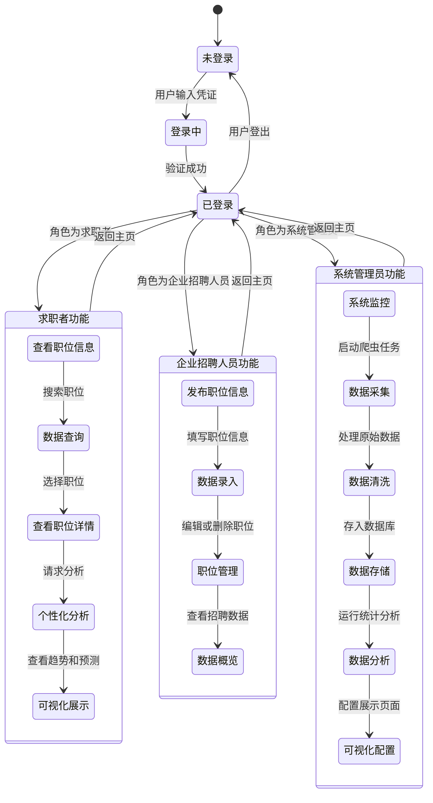

# 职位信息分析系统

## 项目简介
这是一个基于 Flask 开发的职位信息分析系统，提供以下功能：
- 用户登录注册
- 首页数据展示
- 职位精确查询
- 地图可视化
- 词云展示
- 实时数据
- 趋势分析
- 公司类型分析
- 贝叶斯预测

## 环境要求
- Python 3.7+
- MySQL 数据库
- Chrome 浏览器（用于爬虫）

## 🚀 快速开始 (Quick Start)

本节将指导您快速启动并运行本项目。请按照以下步骤操作：

**1. 创建并激活虚拟环境 (Create and Activate Virtual Environment)**

为了隔离项目依赖，强烈建议您创建一个虚拟环境。  
在项目根目录下，执行以下命令：

```bash
# 创建虚拟环境 (仅需执行一次)
    python -m venv venv

# 激活虚拟环境 (每次启动项目前都需要执行)
# 在 macOS/Linux 上：
source venv/bin/activate
# 在 Windows 上 (PowerShell)：
.\venv\Scripts\activate
# 在 Windows 上 (Command Prompt)：
venv\Scripts\activate
```

**2. 安装依赖包 (Install Dependencies)**

本项目的所有依赖包都列在 `requirements.txt` 文件中。  
在激活的虚拟环境中，执行以下命令安装所有依赖：
```bash
pip install -r requirements.txt
```

**3. 运行项目 (Run the Project)**

完成以上步骤后，您就可以运行本项目了。  

```bash
python app.py
# 或者
flask run
```


**4. 访问系统**
- 打开浏览器访问：http://localhost:5000
- 默认会跳转到登录页面：http://localhost:5000/login
- 首次使用需要注册账号 或 使用 账号/密码: admin/admin

<details>
  <summary>爬取数据 (可选)</summary>
如果需要最新数据，运行爬虫脚本：

**1. 创建数据库：**
```sql
CREATE DATABASE boss DEFAULT CHARACTER SET utf8mb4;
```

**2. 导入数据库表结构：**
`user.sql`
`jobs_info.sql`

**3. 修改数据库连接配置（utils/config.py）：**
```python
DB_CONFIG = {
    'host': 'localhost',
    'user': 'your_username',     # 修改为您的数据库用户名
    'password': 'your_password', # 修改为您的数据库密码
    'database': 'boss',
    'charset': 'utf8mb4'
}
```

**4. 运行爬虫脚本**
```bash
python jobSpider.py
```
</details>

## 目录结构
```
├── app.py              # 主程序入口
├── jobSpider.py        # 爬虫程序
├── utils/             # 工具函数目录
│   ├── query.py      # 数据库查询
│   ├── utils.py      # 通用工具函数
│   ├── page_tool.py  # 分页工具
│   └── Bayes.py      # 贝叶斯模型
├── sqls/             # sql目录
│   ├── user.sql          # 用户表结构
│   ├── jobs_info.sql   # 职位信息表结构
├── templates/         # 模板文件目录
└── static/           # 静态文件目录
```

## 注意事项
1. 确保 MySQL 服务已经启动
2. 确保数据库连接配置正确
3. 建议使用虚拟环境运行项目
4. 首次运行需要有数据，可以通过导入示例数据或运行爬虫获取

# 图例

<details>
  <summary>系统架构流程图</summary>



</details>

<details>
  <summary>核心模块时序图</summary>



</details>

<details>
  <summary>核心模块类图</summary>



</details>

<details>
  <summary>系统状态图</summary>



</details>

<details>
  <summary>文件目录树状图</summary>



</details>

<details>
  <summary>数据库关系图</summary>



</details>

<details>
  <summary>数据流图</summary>



</details>

<details>
  <summary>核心功能分解图</summary>



</details>

<details>
  <summary>时序图 - 数据从采集到展示的流程</summary>



</details>

<details>
  <summary>用户状态图</summary>



</details>